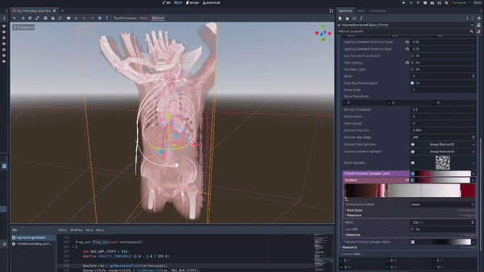
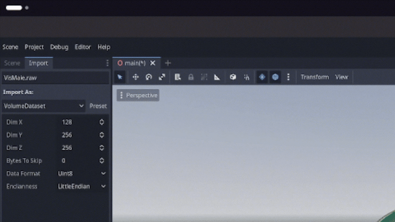
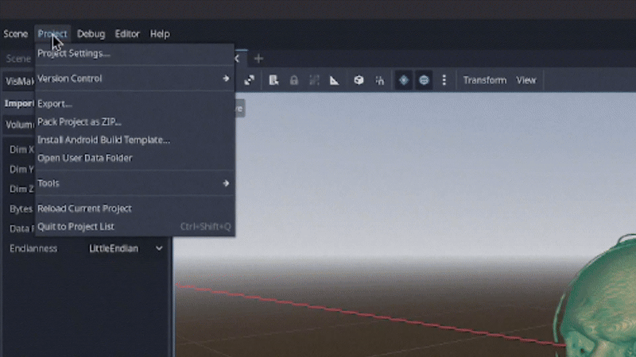
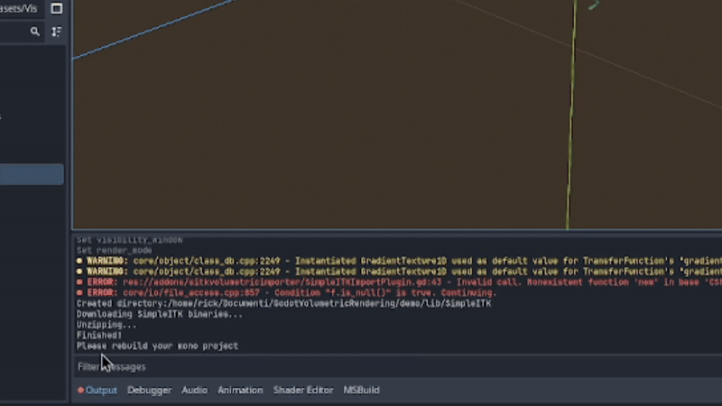

# GodotVolumetricRendering

Volume rendering, implemented in Godot Engine.

This repository builds upon the [work by Matias Lavik](https://github.com/mlavik1/UnityVolumeRendering) implementing the same volumetric rendering in Godot 4

## Features

- [x] Direct volume rendering, using 1D transfer functions
- [x] Maximum intensity projection
- [x] Isosurface rendering, using 1D transfer functions
- [x] Support for SITK file formats:
  - [ ] DICOM support
  - [x] NRRD support
  - [x] NIFTII support
- [x] Lighting*
- [x] Transfer function editor*
- [x] Cubic sampling
- [x] Loading of RAW datasets
- [x] Complete transfer function editor

## Features yet to be ported over

- [ ] Cutout/clipping tools
- [ ] Lighting camera dependent
- [ ] 2D Transfer function

## How to use

1. Add the VolumeRenderedObject node to your scene
2. From the inspector, load a custom resource dataset. (Without mono is still usable! But since the NIFTII, DICOM and NRRD formats are read using the SITK library you will need to have godot-mono installed on your system.)
Optional if you have godot-mono installed:
3. To read all the formats supported by SITK, you need to enable the SITK plugin like so:

4. After that, you can download the SimpleITK binaries from the menu in "Project > Tools > Download and setup SimpleITK":

5. Once the binaries are downloaded, you need to build the mono project:

6. Now you are good to go! :)

You can change the VolumeRenderedObject properties in the inspector.
